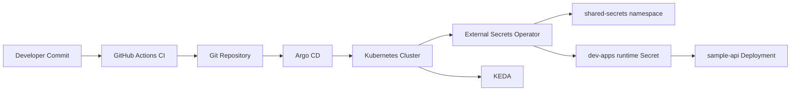

# Architecture

## Logical Flow
1. Developers push changes to Git repository.
2. GitHub Actions validates charts/manifests/policies.
3. Argo CD watches `clusters/dev` and syncs desired state.
4. Platform layer deploys operators (`external-secrets`, `keda`) and cluster security defaults.
5. Workload Helm chart deploys `sample-api`, HPA, KEDA `ScaledObject`, and `ExternalSecret`.
6. External Secrets Operator reads bootstrap secret data from `shared-secrets` namespace via `ClusterSecretStore` and creates runtime secret in `dev-apps`.
7. Pod reads runtime values through `envFrom.secretRef`.

## Diagram

## Environment Model
- `clusters/dev`: source of truth for dev cluster.
- Can be extended with `clusters/stage` and `clusters/prod`.

## Security Baseline
- Pod Security labels on application namespaces.
- Default deny ingress and egress in `dev-apps`.
- Explicit DNS egress allow policy.
- External Secrets source secrets isolated to `shared-secrets` with scoped RBAC.
- SOPS workflow for encrypted secret files in git.
