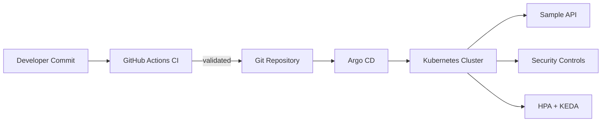

# Architecture

## Logical Flow
1. Developers push changes to Git repository.
2. GitHub Actions validates charts/manifests/policies.
3. Argo CD watches `clusters/dev` and syncs desired state.
4. Workloads are deployed via Helm from `apps/*/chart`.
5. HPA and KEDA adjust replica counts based on signals.
6. Security controls are enforced through:
   - namespace Pod Security labels,
   - NetworkPolicies,
   - Kyverno policies,
   - CI policy gates (Conftest + Trivy).

## Diagram

## Environment Model
- `clusters/dev`: single source of truth for dev cluster.
- Can be extended with `clusters/stage` and `clusters/prod`.

## Security Baseline
- Default deny ingress/egress in app namespace.
- Explicit DNS egress allow rule.
- Non-root container requirement via Kyverno.
- Image tag control (`latest` denied in CI).
